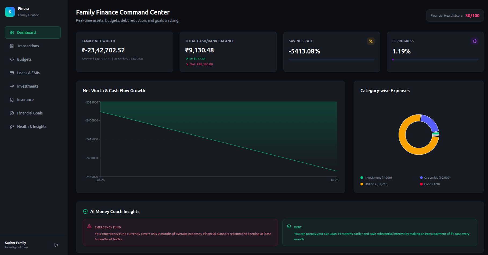
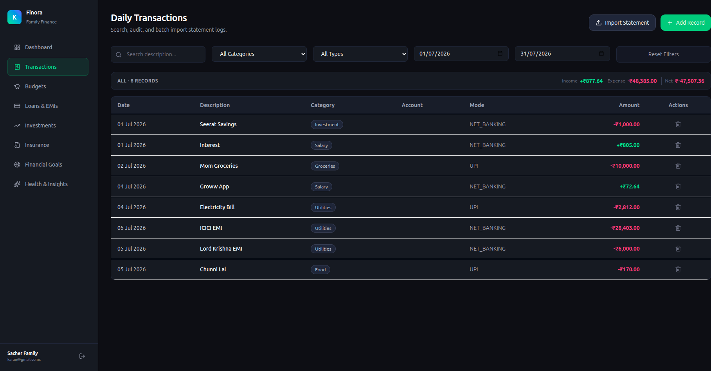
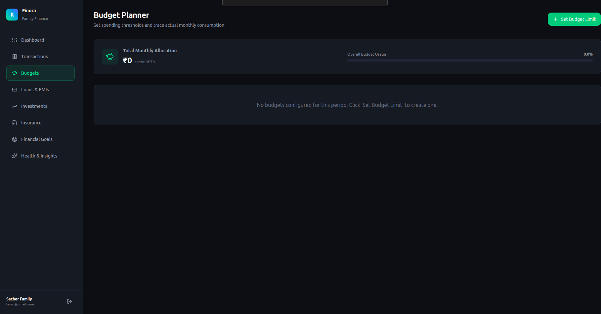
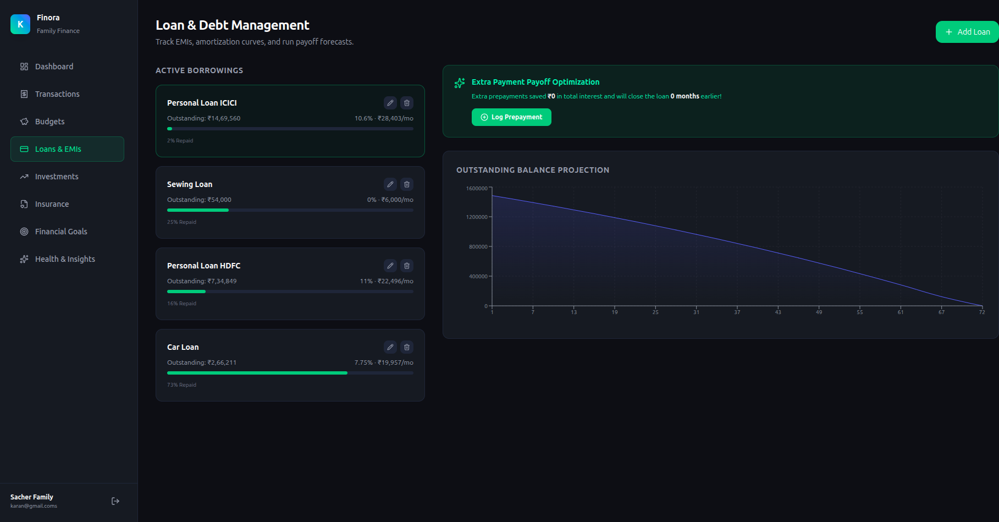
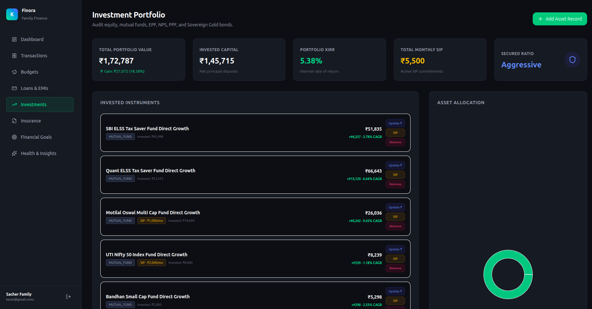
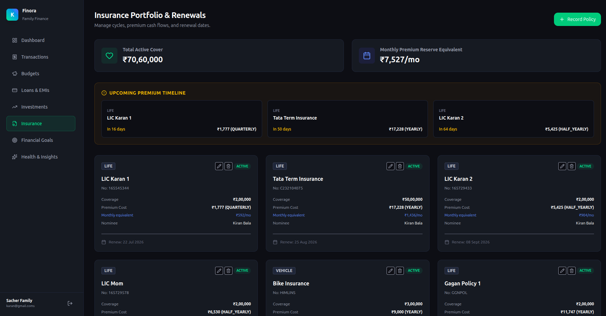
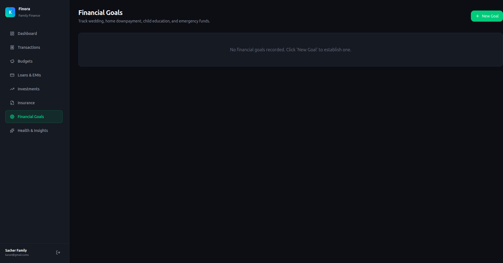
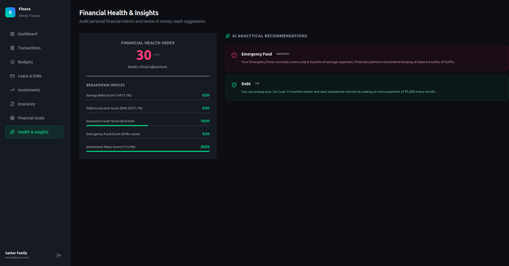

# Finora Frontend

## Stack

React

TypeScript

TailwindCSS

ShadCN UI

React Query

---

## Installation

```bash
npm install
```

```bash
npm run dev
```

---

## Folder Structure

src/

components/

pages/

hooks/

services/

---

## Screenshots

### Dashboard



### Transactions



### Budgets



### Loans & EMIs



### Investments



### Insurance



### Financial Goals



### Health & Insights


